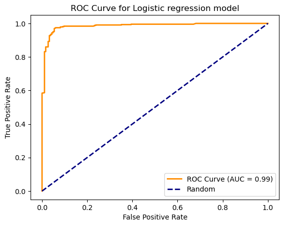
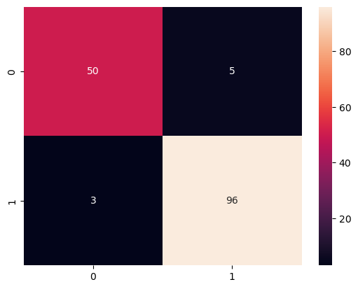

# Model Card: Heart Disease prediction

## Model Description
The model analyzed in this card predicts the presence or absence of heart disease based on patient information (demographic and medical information). The model can return either a classification (presence or absence of the heart disease) or it can also return the probability associated with presence of heart disease and absence of heart disease. The model's goal is to assist clinicians in making predictions based on non-invasive and cheap tests. 

On this page, you can learn more about how well the model performs.

**Input:** 
Demographic and medical information which is categorised or reported in a certain format. 
The five features are: 
<ul>
    <li>Gender: Assign <ul>
        <li>0 for female </li>
        <li> 1 for male</li>
        </ul>
    </li>
    <li>Chest pain: Assign <ul>
        <li>0 for Typical angina</li>
        <li>1 for Atypical angina</li>
        <li>2 for Non-anginal pain </li>
        <li>3 for Asymptomatic patient</li></ul>
    </li>
    <li>Resting ECG results: Assign<ul>
        <li>0 for Normal</li>
        <li>1 for Having ST-T wave abnormality</li>
        <li>2 for showing probable or definite left ventricular hypertrophy by Estes' criteria</li>
        </ul>
    </li>
    <li>Old peak: Value of ST (measure of abnormality in electrocardiograms) between 0 and 6.2.</li>
    <li>Slope: Slope of the peak exercise ST segment, assign<ul>
        <li>1 for upwards</li>
        <li>2 for flat</li>
        <li>3 for downward</li>
        </ul>
    </li>
</ul>

**Output:** The model returns a classification result and probability of whether the individual/patient has heart disease or not. 

**Model Architecture:** Logistic regression model is used with lbfgs solver and C = 0.7. 

## Performance

The performance of the model was tested on training and test set split from the original dataset which can be found on Kaggle (https://www.kaggle.com/datasets/jocelyndumlao/cardiovascular-disease-dataset/data). 

 
Figure 1: Performance of the model shown by ROC curve on the training set (N = 613)
 

 
Figure 2: Confusion matrix for test set classification using the model (N = 154)

## Limitations
<ul>
  <li>The model uses a relatively small dataset (767 individuals after excluding those with anomalous entries).</li>
  <li>The dataset is collected from one hospital in India and therefore, may not be applicable in other parts of the world. </li>
</ul>
A larger dataset collected from multi-centre study (hospitals in different locations) would be needed for wider applicability. 

## Trade-offs

Owing to the small dataset and high accuracy, it is not feasible to identify patterns about the cases when the model performs poorly. 
